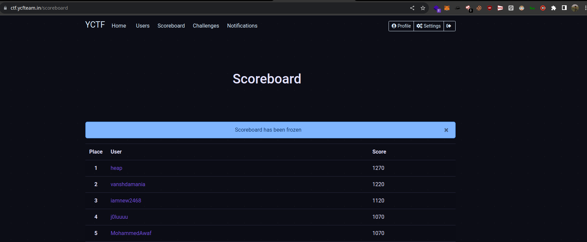

# Format




## Enumeration

### Nmap scan&#x20;

```bash

PORT     STATE SERVICE REASON  VERSION
22/tcp   open  ssh     syn-ack OpenSSH 8.4p1 Debian 5+deb11u1 (protocol 2.0)
| ssh-hostkey:
|   3072 c3:97:ce:83:7d:25:5d:5d:ed:b5:45:cd:f2:0b:05:4f (RSA)
| ssh-rsa AAAAB3NzaC1yc2EAAAADAQABAAABgQC58JQV36v8AqpQB6tJC5upH5YdXw4LMaUJ4Exx+H6PjPZDab5MSx7Zm1oA1DWewM8tmU8fcprIxykYA8Z66Sd5ll/M1WntYO1b3LxxA0kI9F3yXQU+D2LMV6dGsqalJ80WWYcowlt3hZie6gnz4qEDj7ijCFi5h8K4R2rKtA16sH4FC9EQQU7qgN4WkE7uJSJS/6tWREtV/PspxsiMSBhUE0BreHurM6eaTZGa0VHOyNpbsZ3KXDro0fIOlfovRJVdAwWXF740M+X3aVngS9p1+XrnsVIqcL9T7GdU6H2Tyl5JvnGLdOr2Etd9NW41f+g+RYl7QY6WYbX+30racRmcTUtH4DODyeDXazi6fRUiXBI8pXkD3oLMBSxXsbeGT8Ja3LECPTybIl/jH3KRfl46P7TIUYZ2kqTZqxJ1B6klyZY+woh24UPDrZu/rW9JMaBz2tg97tAiLR8pLZxLrpVH7YmV8vXk2Sgo1rEuqKhBAK98bQuAsbocbjiyrKYAACc=
|   256 b3:aa:30:35:2b:99:7d:20:fe:b6:75:88:40:a5:17:c1 (ECDSA)
| ecdsa-sha2-nistp256 AAAAE2VjZHNhLXNoYTItbmlzdHAyNTYAAAAIbmlzdHAyNTYAAABBBAxL4FuxiK0hKkwexmffoZfwAs+0TzHjqgv3sbokWQzlt+YGLBXHmGuLjgjfi9Ir49zbxEL6iAOv8/Mj8hUPQVk=
|   256 fa:b3:7d:6e:1a:bc:d1:4b:68:ed:d6:e8:97:67:27:d7 (ED25519)
|_ssh-ed25519 AAAAC3NzaC1lZDI1NTE5AAAAIK9eUks4+f4DtePOKRJYzDggTf1cOpMhtAxXHGSqr5ng
80/tcp   open  http    syn-ack nginx 1.18.0
|_http-server-header: nginx/1.18.0
|_http-title: 404 Not Found
3000/tcp open  http    syn-ack nginx 1.18.0
| http-methods:
|_  Supported Methods: GET HEAD
|_http-favicon: Unknown favicon MD5: F6E1A9128148EEAD9EFF823C540EF471
|_http-server-header: nginx/1.18.0
|_http-title:  Microblog
Service Info: OS: Linux; CPE: cpe:/o:linux:linux_kernel
```


* On initial visit on the Machine's IP, we are redirected to -> `app.microblog.htb` (let's add this in our /etc/hosts file)


<figure><figcaption><p>It redirects us to the git url (port 3000) of this app</p></figcaption></figure>


<figure><figcaption></figcaption></figure>

* we now have the src code of the website, let's clone & analyse this.


* Upon looking into `microblog folder` we found 2 sub domains

```bash
└─➜ tree microblog                                                                                                                                                                       [2]
microblog
├── app
│   ├── brain.ico
│   ├── brain.png
│   ├── dashboard
│   │   └── index.php
│   ├── index.php
│   ├── login
│   │   └── index.php
│   ├── logout
│   │   └── index.php
│   └── register
│       └── index.php
└── sunny
    ├── content
    │   ├── 2766wxkoacy
    │   ├── jtdpx1iea5
    │   ├── order.txt
    │   ├── rle1v1hnms
    │   └── syubx3wiu3e
    ├── edit
    │   └── index.php
    ├── images
    │   └── brain.ico
    └── index.php

10 directories, 15 files
```

* app & sunny. Let's add sunny in our `/etc/hosts` file.
* Sunny's subdomain is nothing but a blog written & posted by him.
* On homepage we noticed that we can get a subdomain by registering so let's do it.


### LFI

* After registering we now can create subdomains.

<figure><figcaption></figcaption></figure>

Let's add this in our `/etc/hosts` file

#### Create a blog

<figure><figcaption></figcaption></figure>

* after visiting your subdomain, you can now see the blog content.


### Why LFI?

* if you checked the src code whatever we send inside the `id` parameter get's written inside our blog
* Contents of `microblog/microblog/sunny/edit/index.php`

```php
//add text
if (isset($_POST['txt']) && isset($_POST['id'])) {
    chdir(getcwd() . "/../content");
    $txt_nl = nl2br($_POST['txt']);
    $html = "<div class = \"blog-text\">{$txt_nl}</div>";
    
    $post_file = fopen("{$_POST['id']}", "w");
    fwrite($post_file, $html);
    fclose($post_file);

    <-- REDACTED -->
}

```

* Let's add location of `/etc/passwd` & see if it works


<figure><figcaption><p>YEHP it works!!!!</p></figcaption></figure>

* I surfed for a while & found no important files that can help us to get a rev shell on the machine.
* While reviweing the src code of `edit/index.php` , i saw there's something called `pro feature`
* Let's try to get a pro version on our account.


\-------- the machine went vip sry couldn't complete :(

\------- i'll surely complete this once i get VIP.

